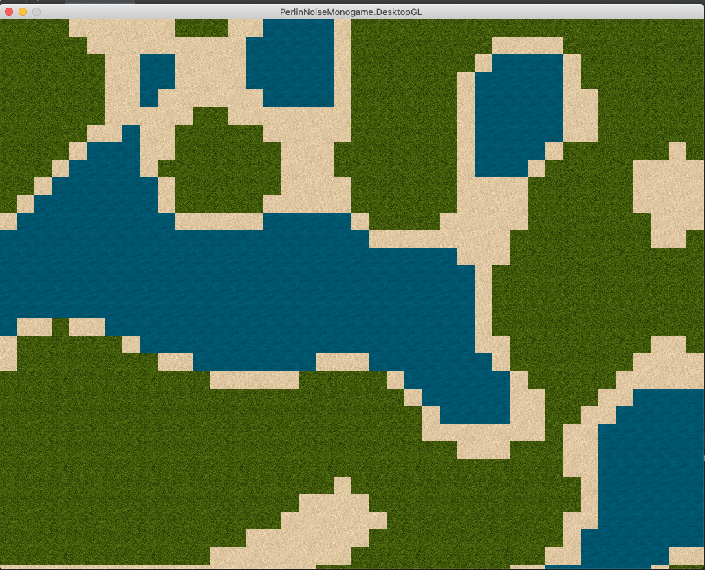
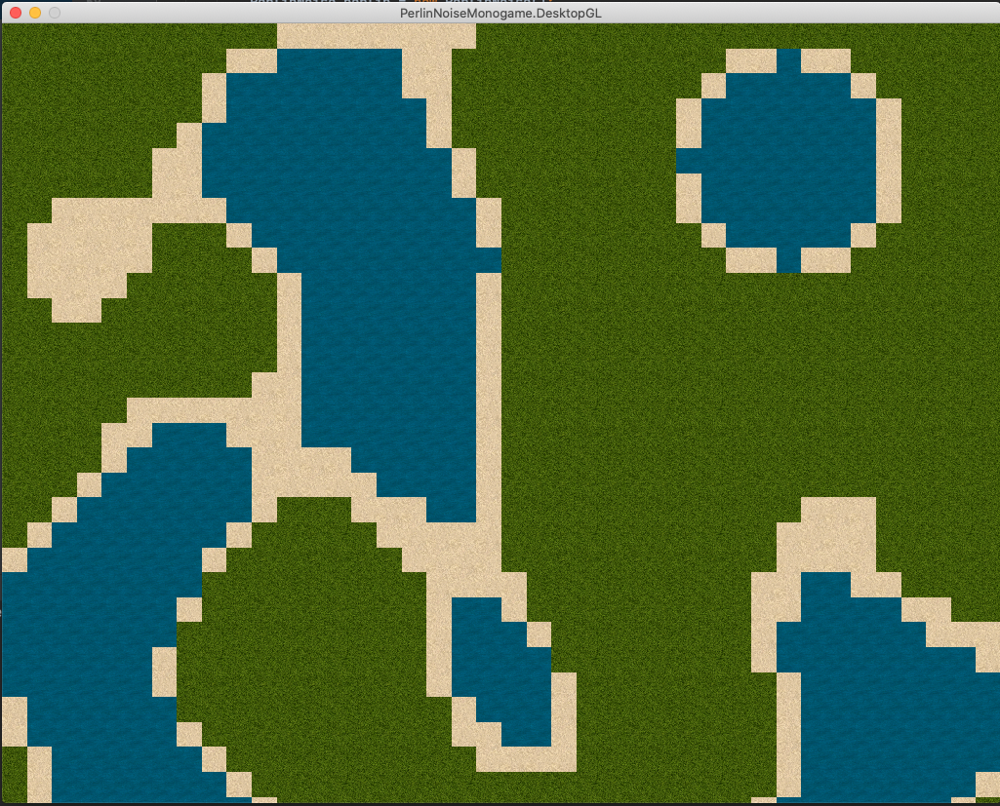

# Perlin Noise Implementation for 2D Games With C#

This Project is a implementation of Perlin Noise in C# only for 2D games.
Generates maps with edges that make sense for you sprites, like sand close to water. How can you see in examples.

## How to Run

It's just a Monogame project using NetCore3.1, run as you would with any NetCore project.

```bash
nuget restore
cd PerlinNoiseMonogame.DesktopGL
netcore build
dotnet bin/Debug/netcoreapp3.0/PerlinNoiseMonogame.DesktopGL.dll
```

## Usage
Inside perlin folder has all implementation itself, you can use only perlin folder in your project.

## Samples



## Contributing
Pull requests are welcome. For major changes, please open an issue first to discuss what you would like to change.

